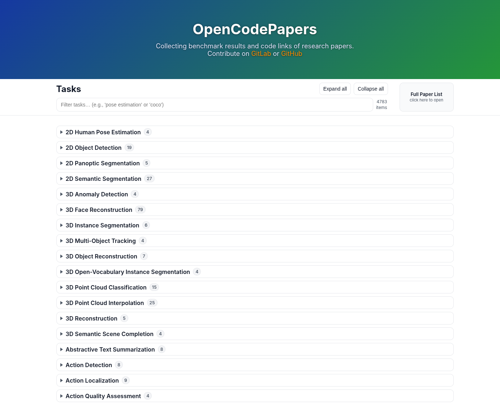
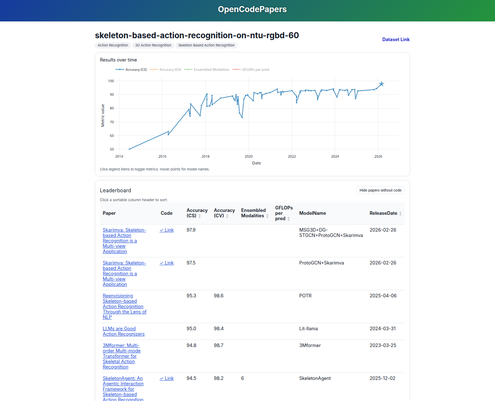

# OpenCodePapers

Collecting benchmark results and code links of research papers.

<div align="center">
    
    &nbsp;&nbsp;&nbsp;&nbsp;&nbsp;
    
</div>

<br>

[](https://gitlab.com/OpenCodePapers/OpenCodePapers/-/commits/main)
[](https://gitlab.com/OpenCodePapers/OpenCodePapers/-/commits/main)
[](https://github.com/psf/black)
[](https://github.com/prettier/prettier)

<br>

## Benchmarks

See [WEBSITE](https://opencodepapers-b7572d.gitlab.io/) for the main overview.

<br>

## Contributing

The initial data was taken from the now discontinued [PapersWithCode](https://github.com/paperswithcode) project. \
To keep the results up to date, help from the community is required. \
See [CONTRIBUTING](./CONTRIBUTING.md) for more info.

<br>

## Badges

If you like, you can include badges in your repository readme to show the current benchmark rank of your project.

[](https://opencodepapers-b7572d.gitlab.io/benchmarks/3d-multi-person-pose-estimation-on-shelf.html)

Include it with the following template. Replace `[benchmark]` and get `[badgename]` by searching for the _benchmark_ and then the _project_ on the file overview at: [Link](https://opencodepapers-b7572d.gitlab.io/badges/)

```markdown
[](https://opencodepapers-b7572d.gitlab.io/benchmarks/[benchmark].html)
```
